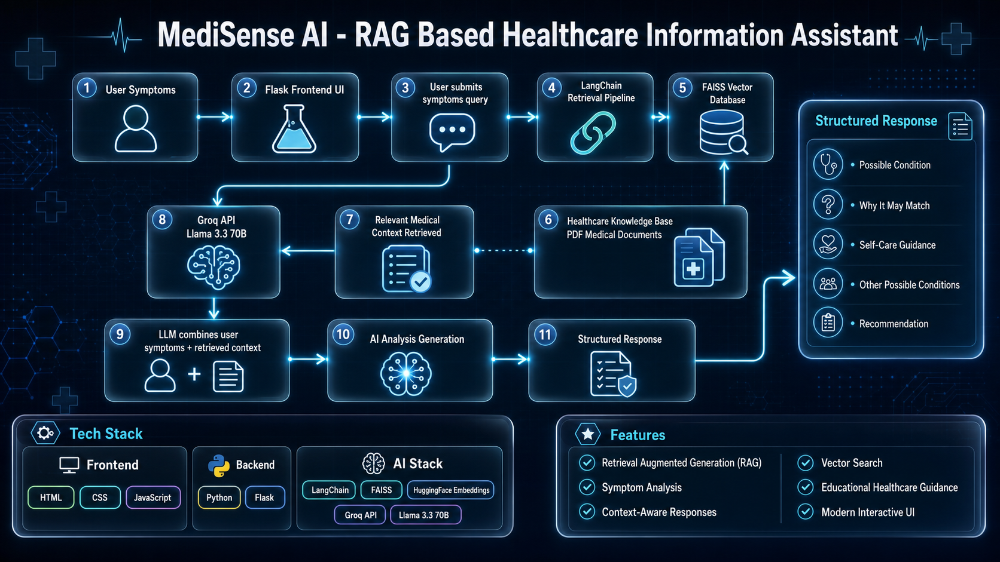
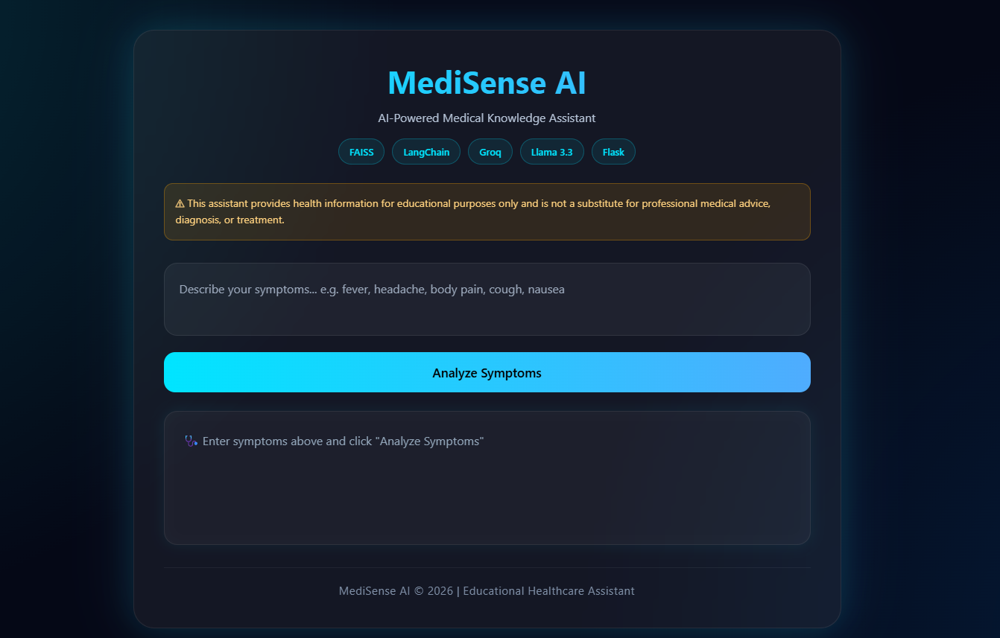
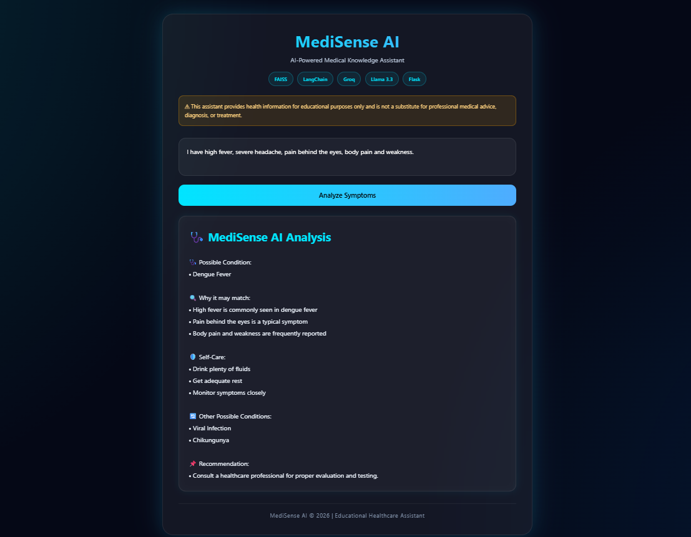

# 🩺 MediSense AI

AI-Powered Healthcare Information Assistant built using Retrieval-Augmented Generation (RAG).

## 📌 Overview

MediSense AI is a RAG-based healthcare information assistant that helps users understand possible health conditions based on their symptoms.

The system retrieves relevant medical information from a healthcare knowledge base and generates structured educational responses using a Large Language Model.

⚠️ This project is intended for educational purposes only and is not a substitute for professional medical advice, diagnosis, or treatment.

---

## 🚀 Features

- Symptom-based health analysis
- Retrieval-Augmented Generation (RAG)
- Context-aware medical information retrieval
- AI-generated health insights
- Structured and easy-to-understand responses
- Modern responsive user interface

---

## 🛠️ Tech Stack

### Frontend
- HTML
- CSS
- JavaScript

### Backend
- Python
- Flask

### AI Stack
- LangChain
- FAISS Vector Database
- HuggingFace Embeddings
- Groq API
- Llama 3.3 70B

---

## ⚙️ How It Works

1. User enters symptoms through the web interface.
2. Flask backend receives the query.
3. LangChain retrieves relevant medical information from the FAISS vector database.
4. Relevant healthcare context is passed to the LLM.
5. Groq Llama 3.3 generates a contextual response.
6. Structured healthcare information is displayed to the user.

---

## 🏗️ Architecture



---

## 📸 Screenshots

### Home Page



### Symptom Analysis



---

## 📂 Project Structure

```text
MediSense-AI/
│
├── data/
├── health_faiss_db/
├── static/
│   ├── style.css
│   └── script.js
│
├── templates/
│   └── index.html
│
├── app.py
├── requirements.txt
├── README.md
└── LICENSE
```

## 🔧 Installation

### Clone Repository

```bash
git clone https://github.com/Jainishk-coder/MediSense-AI.git
cd MediSense-AI
```

### Install Dependencies

```bash
pip install -r requirements.txt
```

### Create Environment Variable

Create a `.env` file:

```env
GROQ_API_KEY=your_api_key_here
```

### Run Application

```bash
python app.py
```

Open:

```text
http://127.0.0.1:5000
```

---

## 🎯 Future Improvements

- More healthcare knowledge sources
- Better disease ranking system
- Multi-language support
- Chat history support
- Cloud deployment

---

## 👨‍💻 Author

**Jainish Kandoliya**

Aspiring AI/ML Engineer | B.Tech CSE

- LinkedIn: https://www.linkedin.com/in/kandoliya-jainish
- GitHub: https://github.com/Jainishk-coder

---

## 📜 License

This project is licensed under the MIT License.
